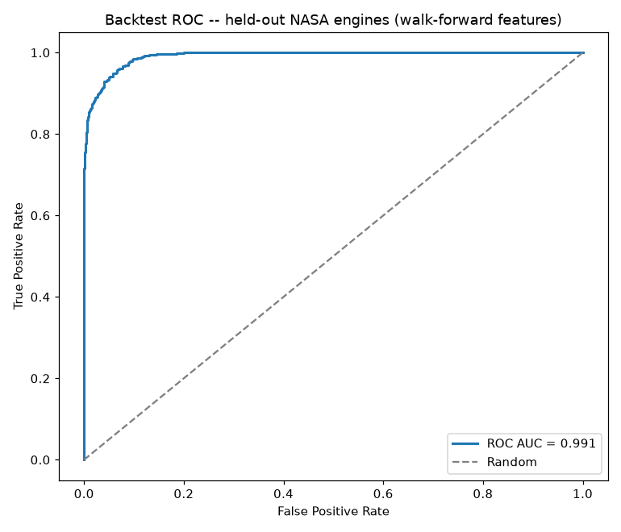
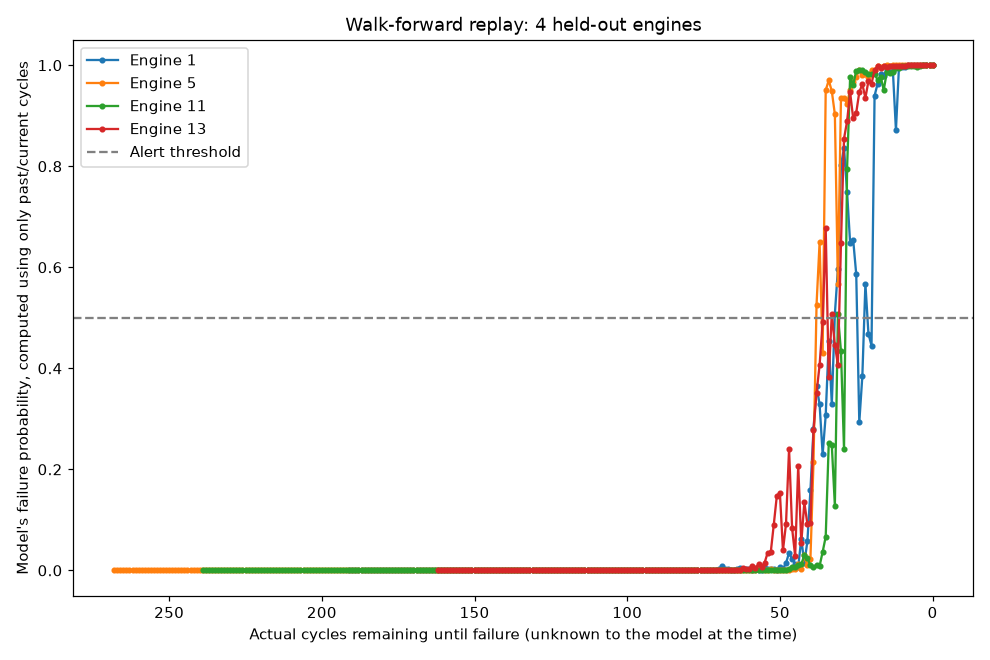
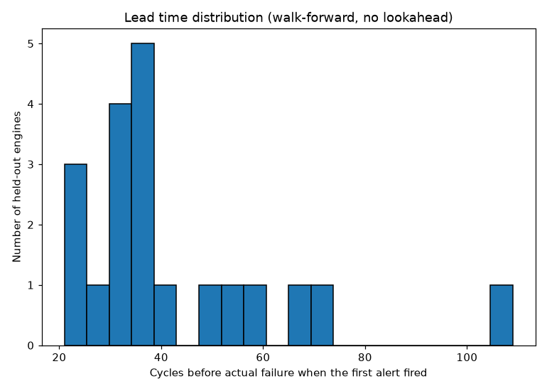

# Backtest: real run-to-failure data, no lookahead

**Dataset:** NASA C-MAPSS turbofan engine degradation simulations (FD001) --
real physics simulations from NASA's Prognostics Center of Excellence, the
standard benchmark in predictive-maintenance research. 100
engines, each run from healthy to actual failure.

This is a **separate model from the AI4I2020 one** (`train.py`/`app.py`). It exists
to prove the backtesting methodology on data that has a real timeline, because
AI4I2020 is a one-time snapshot with no dates to backtest over.

## Two leakage guards

1. **Engine holdout** -- 80 engines used for training,
   20 completely different engines held out for testing.
   No engine appears in both.
2. **Cycle causality** -- every feature at cycle *t* is built only from that
   engine's rows at cycle ≤ *t*. Verified by literally replaying each test
   engine cycle-by-cycle, truncating the data to "now" each time.

## Held-out engines (never trained on)

| Metric | Value |
|---|---|
| ROC AUC | 0.991 |
| PR AUC | 0.963 |
| Precision @ 0.5 | 0.735 |
| Recall @ 0.5 | 0.948 |

Confusion matrix (row-level, "will fail within 30 cycles"): caught **588**
of 620 at-risk readings, missed 32, 212 false alarms out of 3450
healthy readings.

## Walk-forward replay (the actual backtest)

Alerted **20 of 20** held-out engines before they
failed, using only data available at the time.
Lead time when the alert first fired: median **36** cycles before failure (mean 42.8, range 21-109).

