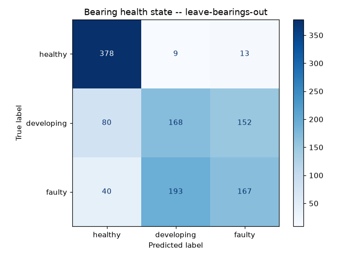
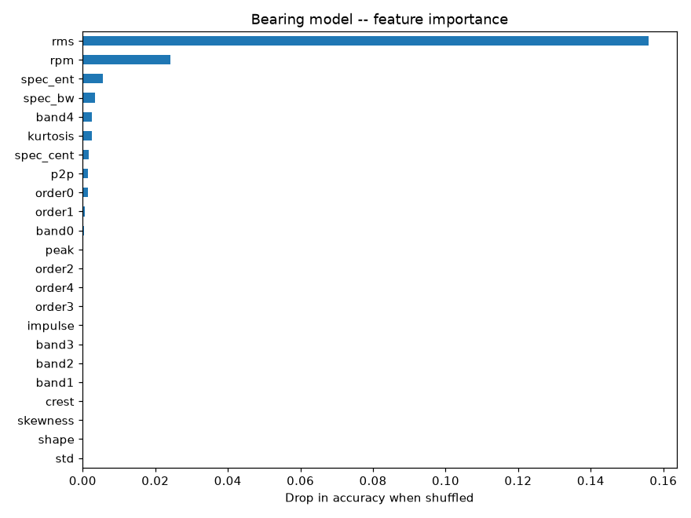

# Bearing / rotating-equipment model

Covers motors, pumps, fans, compressors, gearboxes -- anything whose dominant failure mode
is bearing wear.

**Dataset:** University of Ottawa Rolling-element Dataset (UORED-VAFCLS),
[doi:10.17632/y2px5tg92h.2](https://data.mendeley.com/datasets/y2px5tg92h/2), CC BY 4.0 --
**20 real bearings**, each recorded **healthy -> developing fault -> faulty** (60 recordings,
42 kHz accelerometer). Replaces the earlier CWRU model (only 10 recordings; 38.8% on held-out).

**Leakage guard -- leave-bearings-out:** each of 5 folds holds out 4 whole physical bearings
(all three of their states). Accelerometer only; the temperature channel is excluded because
it has corrupted values and drifts through each test sequence.

**Order-tracking:** features now include vibration energy expressed as multiples of shaft
speed (not just fixed Hz bands), the standard way to make a reading comparable across
machines running at different speeds -- bearing fault frequencies scale with shaft speed,
not absolute Hz. This rig ran at ~1700-1820 RPM; generalizing to a real customer motor at,
say, 900 or 3600 RPM is a methodological improvement, not a validated result -- there's no
data here outside that range to test it against.

| Metric (bearings never seen in training) | Value |
|---|---|
| Healthy vs. damaged ROC AUC | 0.937 |
| **Developing faults caught** (early warning) | **80%** of windows · 16/20 recordings |
| Fully faulty caught | 90% of windows |
| False alarms on healthy bearings | 6% of windows · 1/20 recordings |
| Health state correct (per recording, 3 states) | 35/60 |
| Fault type correct (damaged windows, 4 types) | 65% |

