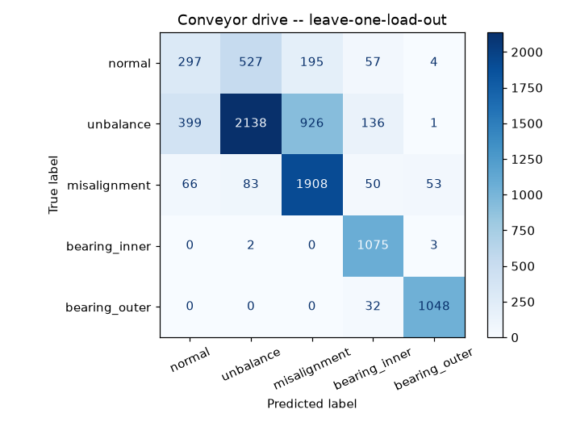

# Conveyor drive model

Covers the conveyor's **drive train** -- motor, coupling, shaft and bearings -- where most
unplanned conveyor downtime starts. **Not covered:** belt tears, belt mistracking, idler
failures (no reliable open dataset exists for those; see README).

**Dataset:** KAIST rotating-machine dataset (Jung et al., *Data in Brief* 2023),
[doi:10.17632/ztmf3m7h5x.6](https://data.mendeley.com/datasets/ztmf3m7h5x/6), CC BY 4.0 --
a real test rig with bearing inner/outer-race defects, shaft misalignment and rotor unbalance
at several severities, under three loads. Vibration (4 accelerometers, 25.6 kHz),
order-tracked. The same dataset's motor-current files were examined first and **rejected**:
their features tracked a 48 vs 49 Hz supply difference between recording sessions, not the
faults.

**Leakage guard -- leave-one-load-out:** each load level is scored by a model trained only on
the other two.

| Metric (load never seen in training) | Value |
|---|---|
| Fault vs. normal ROC AUC | 0.877 |
| Fault windows flagged | 96% |
| False alarms on normal running | 77% |
| Recordings correctly diagnosed (majority vote) | 37 / 45 |
| Diagnosis macro F1 (5 classes) | 0.715 |

Per class (window accuracy):

| Class | Correct |
|---|---|
| normal | 28% |
| unbalance | 59% |
| misalignment | 88% |
| bearing_inner | 100% |
| bearing_outer | 97% |

Flag rate by fault severity -- the honest picture of what it can and can't catch:

| Fault | Severity | Flagged |
|---|---|---|
| bearing_inner | 03 | 100% |
| bearing_inner | 10 | 100% |
| bearing_inner | 30 | 100% |
| bearing_outer | 03 | 100% |
| bearing_outer | 10 | 100% |
| bearing_outer | 30 | 100% |
| misalignment | 01 | 91% |
| misalignment | 03 | 100% |
| misalignment | 05 | 100% |
| normal | none | 77% |
| unbalance | 0583mg | 79% |
| unbalance | 1169mg | 91% |
| unbalance | 1751mg | 94% |
| unbalance | 2239mg | 97% |
| unbalance | 3318mg | 100% |

Physically, small unbalance barely changes vibration (1x amplitude only rises clearly from
~2.2 g of added mass up), so light unbalance is expected to be missed.

