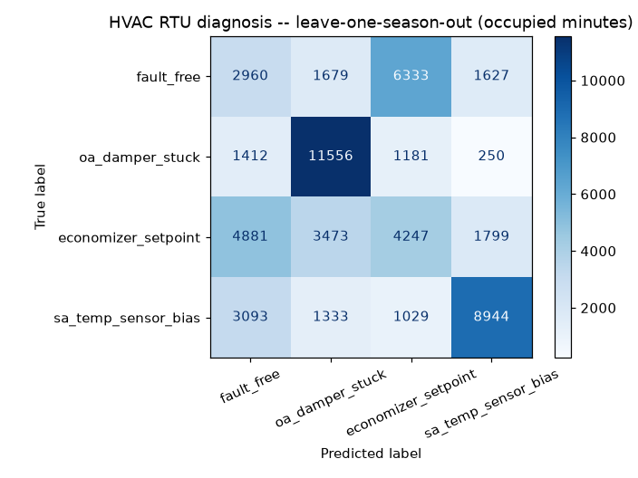

# HVAC rooftop-unit model

**Dataset:** LBNL Fault Detection & Diagnostics Data Sets (U.S. DOE; LBNL, ORNL, NREL),
[DOI 10.25984/1881324](https://dx.doi.org/10.25984/1881324) -- the **experimental**
subset: a real Trane YCD150 12.5-ton rooftop unit at Oak Ridge National Laboratory's
Flexible Research Platform, with faults physically imposed one day at a time across four
seasons. 89,280 minutes, 62 unit-days.

**Leakage guard -- leave-one-season-out:** every number below comes from days scored by a
model trained only on the *other three seasons*. The alert threshold was also chosen without
the held-out season: by a second, nested leave-one-season-out inside the training seasons,
targeting at most 20% false alarms on fault-free days.

| Metric | Value |
|---|---|
| Day-level ROC AUC (fault day vs. fault-free day) | 0.616 |
| Minute-level ROC AUC (occupied hours) | 0.614 |
| Minute-level PR AUC (occupied hours) | 0.863 |
| Fault days flagged | **9 / 48** (19%) |
| False alarms on fault-free days | 0 / 14 |
| Fault type correctly named (fault days) | 58% |
| Median detection time after occupied hours begin | 0 min |

Per fault type (day level):

| Fault | Fault days | Flagged |
|---|---|---|
| economizer_setpoint | 16 | 0% |
| oa_damper_stuck | 16 | 38% |
| sa_temp_sensor_bias | 16 | 19% |

**Caveats.** In this experiment the damper and supply-air faults were imposed by changing
the unit's *control program*, so part of their signature is in the commanded signals
themselves. On a real building the same model sees commanded vs. measured values, which is
the stronger signal -- but it has only been validated on this one unit. Faults only show up
while the unit is running, so unoccupied night hours are excluded from the headline metrics.

