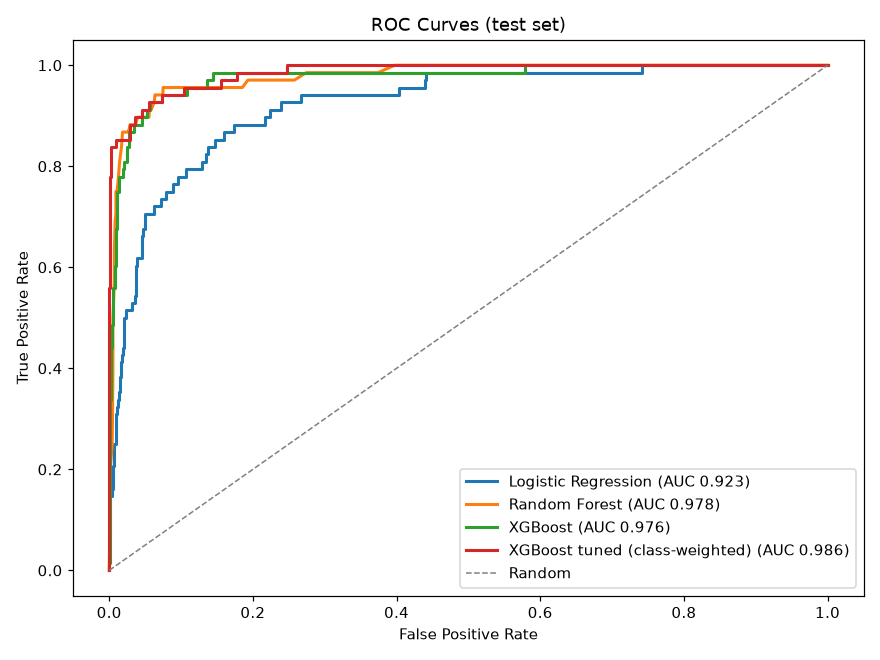
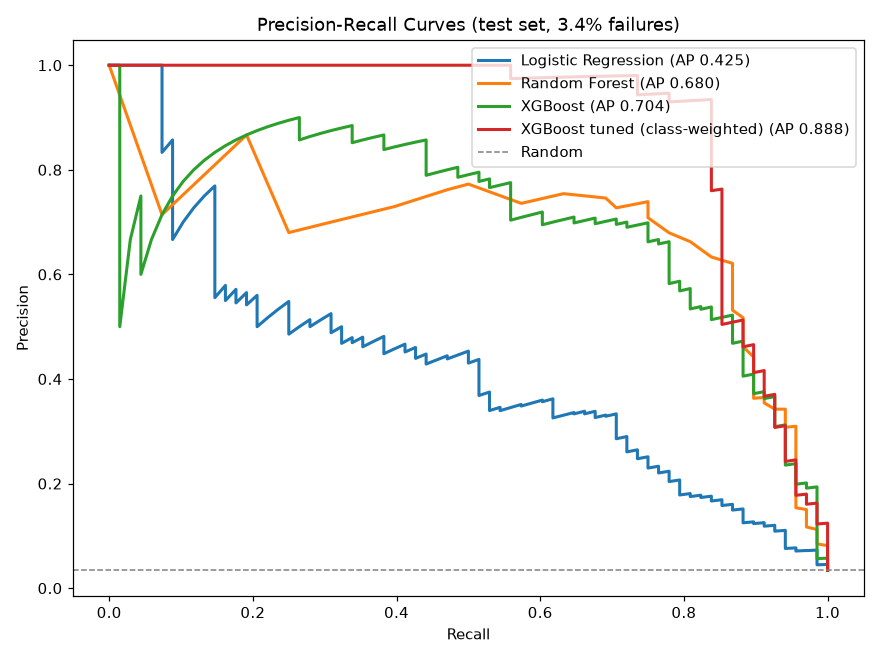
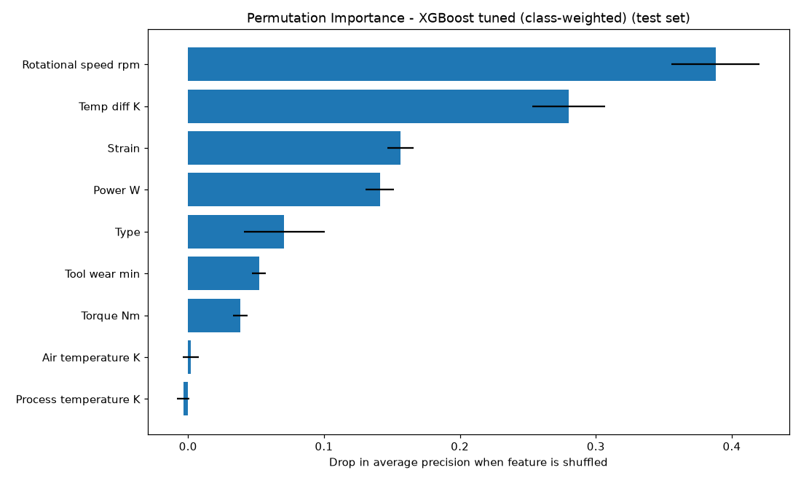
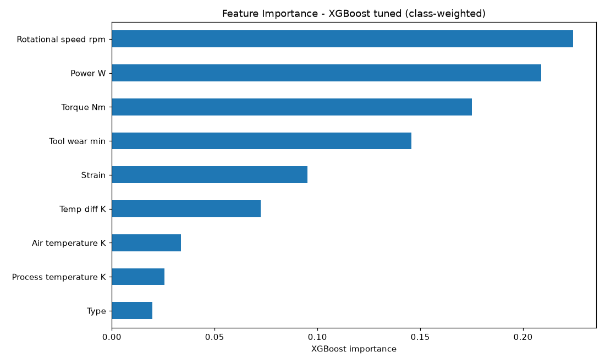
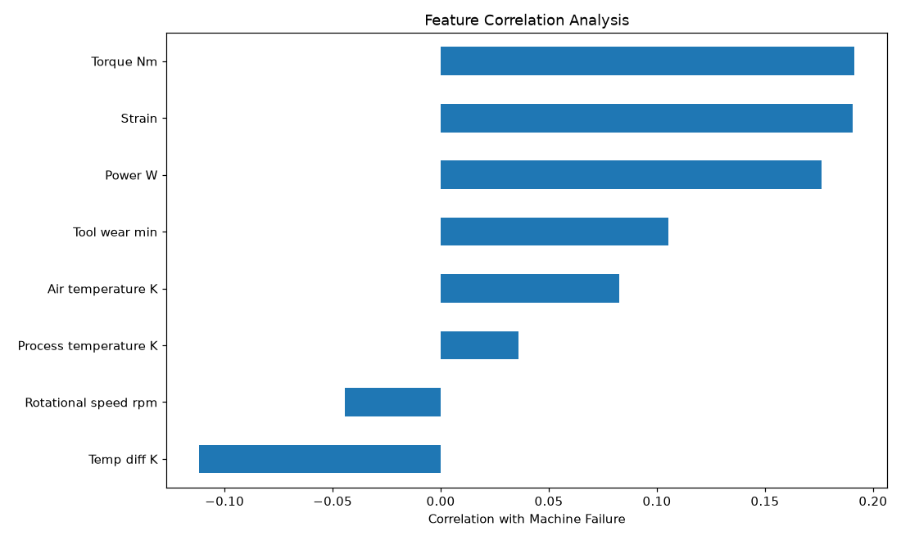

# Results

Test set: 2000 machines, 68 failures (real failure rate, never resampled).

## Model comparison

| Model | Trained on | CV ROC AUC | Test ROC AUC | Test PR AUC | Precision @0.5 | Recall @0.5 |
|---|---|---|---|---|---|---|
| Logistic Regression | undersampled | 0.901 | 0.923 | 0.425 | 0.158 | 0.853 |
| Random Forest | undersampled | 0.970 | 0.978 | 0.680 | 0.264 | 0.956 |
| XGBoost | undersampled | 0.965 | 0.976 | 0.704 | 0.291 | 0.941 |
| XGBoost tuned (class-weighted) | all rows | 0.978 | 0.986 | 0.888 | 0.864 | 0.838 |

## Final model: XGBoost tuned (class-weighted)

Alert threshold **0.279**, chosen by cross-validation on the training data to reach recall ≥ 0.85.

| Metric | Test value | Guide target |
|---|---|---|
| ROC AUC | 0.986 | ≥ 0.90 ✅ |
| Recall | 0.853 | ≥ 0.85 ✅ |
| Precision | 0.667 | — |
| F1 | 0.748 | — |
| PR AUC | 0.888 | — (random = 0.034) |

Confusion matrix: caught **58** of 68 failures, missed 10, with 29 false alarms across 1932 healthy machines.

Best hyperparameters: `{"subsample": 1.0, "reg_lambda": 3, "n_estimators": 500, "min_child_weight": 1, "max_depth": 6, "learning_rate": 0.03, "colsample_bytree": 0.85}`

## What drives the predictions (permutation importance)

| Feature | Drop in PR AUC when shuffled |
|---|---|
| Rotational speed rpm | 0.388 |
| Temp diff K | 0.280 |
| Strain | 0.156 |
| Power W | 0.141 |
| Type | 0.071 |
| Tool wear min | 0.052 |
| Torque Nm | 0.038 |
| Air temperature K | 0.002 |
| Process temperature K | -0.004 |

## Plots

