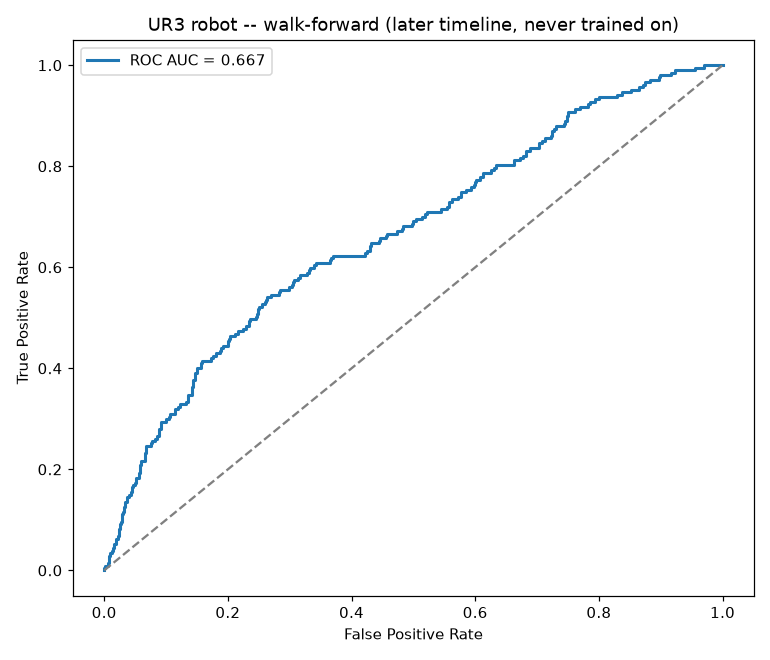

# Robotic arm model

**Dataset:** [UR3 CobotOps](https://archive.ics.uci.edu/dataset/963/ur3+cobotops), UCI Machine
Learning Repository -- real telemetry from a Universal Robots UR3 collaborative robot:
current, temperature and speed of all 6 joints, gripper current, and the robot's own logged
**protective stops** and **grip losses**. 7,409 readings (~1/s).

**Task:** predict that a protective stop or grip loss will *start* within the next
10 readings (~10 s) -- a look-ahead warning, not detecting a stop already underway.

**Leakage guard -- chronological walk-forward:** trained on the first
70% of the robot's timeline, scored on the last 30%, with a
10-reading gap between them. Every feature uses only past readings.

| Metric (later timeline, never trained on) | Value |
|---|---|
| ROC AUC | 0.667 |
| PR AUC | 0.190 (random = 0.096) |
| Precision / recall @ 0.5 | 0.22 / 0.31 |
| Events warned before they started | **17 / 24** |
| Median warning lead | 7 readings |
| Protective stops warned | 0 / 0 |
| Grip losses warned | 17 / 24 |

**Caveats.** One robot, one workcell, one program. Protective stops can be caused by things
no sensor sees coming (a person bumping the arm), so a perfect score isn't possible. Retrain
on a customer's own robot logs before relying on it.

