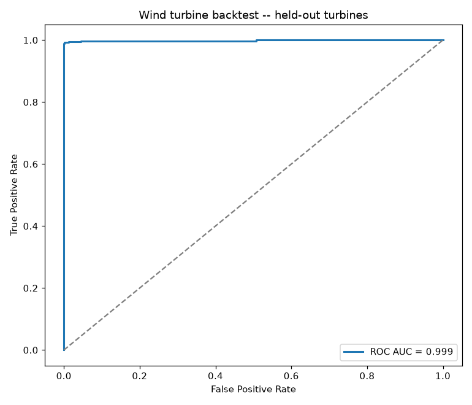

# Wind turbine / generator model

**Dataset:** real wind-farm SCADA telemetry, subsampled while streaming the
real ~12 GB source (up to 1500 rows for each of 12
real turbines) -- a bounded real sample, not synthetic data.

**Leakage guards:** 8 turbines trained on, 4
completely different turbines held out. All rolling features use only each
turbine's own past readings.

| Metric (held-out turbines) | Value |
|---|---|
| ROC AUC | 0.999 |
| PR AUC | 0.996 |
| Precision @ 0.5 | 0.995 |
| Recall @ 0.5 | 0.990 |

Of 378 real events on held-out turbines, the model's alert (using
only that turbine's own past data) was already on a median of
**32 readings** before the event.

